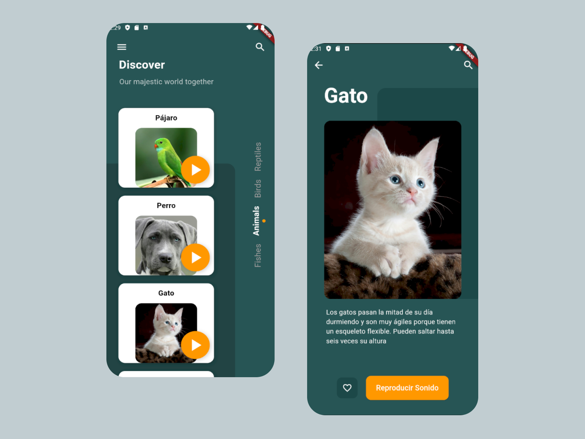

# Prueba de Flutter: Pseudo Clon de una App

Este proyecto es una práctica de Flutter diseñada para replicar parcialmente la funcionalidad y el diseño de una aplicación existente. Se incluye la funcionalidad de mostrar información y reproducir sonidos asociados a diferentes animales.

### Vista Original

Esta es una captura de pantalla de la app original que se replicó parcialmente:

### Resultado de la Prueba

Esta es la captura de pantalla de la app que se desarrolló en Flutter como práctica:

